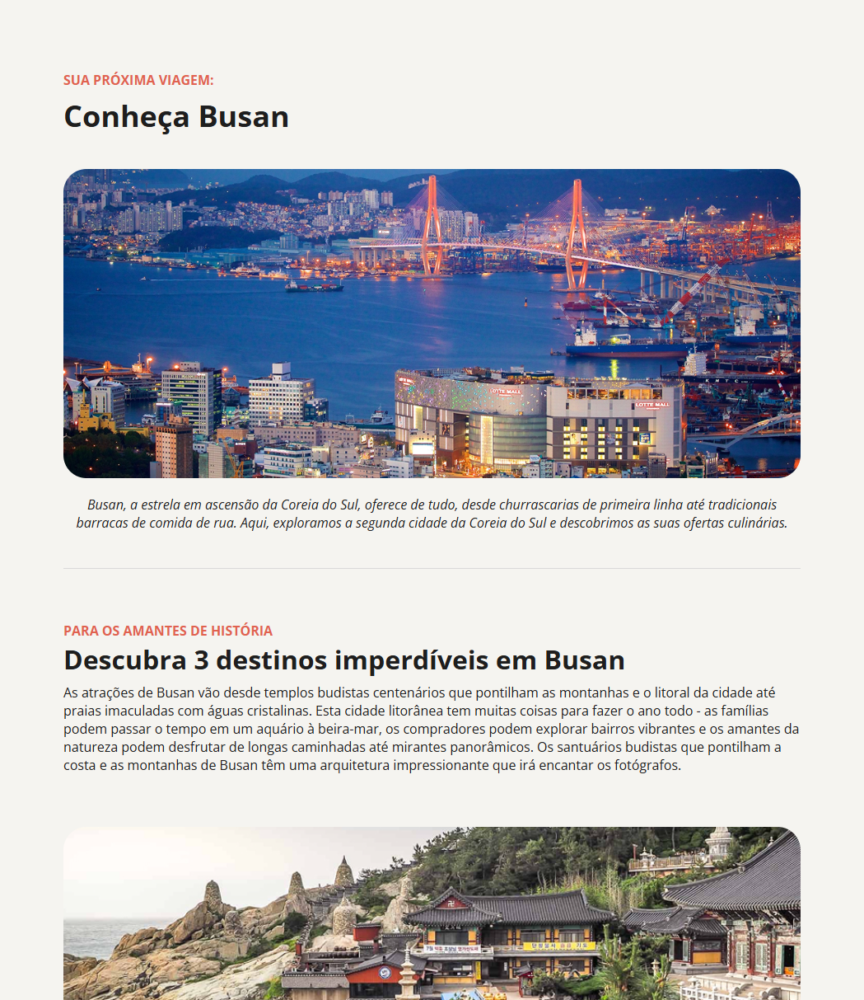

# Repositório Desafio - Local Turístico

🚀 Um repositório destinado para o desafio prático Local Turístico da jornada do curso **Full-Stack** da Rocketseat, ministrado pelo Mayk Brito. ⚒

> Formação Full-Stack: [Nível 3] Iniciando o HTML e CSS (Desafio Prático)

O projeto desenvolvido é uma página web com informações sobre um determinado local turístico.

[🔗 Veja o projeto](fesette.github.io/Local-turistico/)

## 🛠️ Tecnologias

- HTML
- CSS
- Git e Github